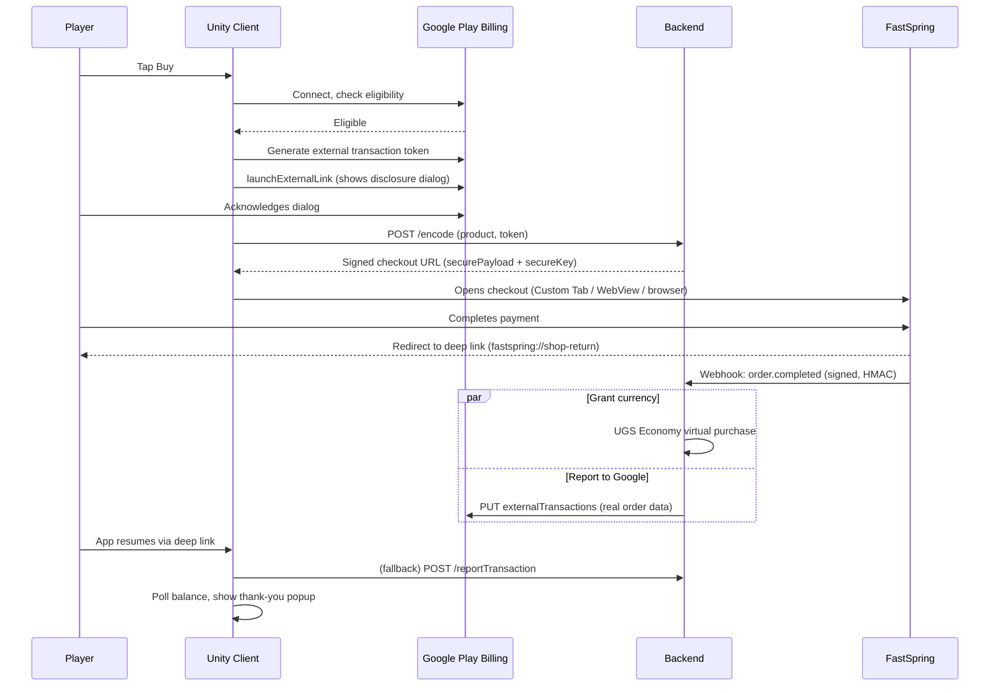

# FSBuilds: Google Play External Content Links + FastSpring Checkout Integration

This is a working reference implementation showing how a mobile game sells in-game currency through a **FastSpring web checkout** instead of the platform's native in-app purchase system, while staying compliant with **Google Play's External Content Links** program (the Android "steering" program — sometimes called Steer Safe on the FastSpring side). It demonstrates the full flow: a player taps "Buy," Google shows its required disclosure that they're leaving Play Billing, the player completes payment on a FastSpring-hosted checkout, and the game credits their currency the moment FastSpring's webhook confirms the order — with the transaction also reported back to Google, as the program requires.

The main build, **EggBlast Arena**, is a Unity game backed by Unity Gaming Services (UGS) for auth and the player economy. A smaller React Native example (`Native/`) shows the same FastSpring checkout pattern for a subscription app, without the Google steering piece.

This project lives inside FastSpring's [fastspring-fsBuilds-examples](https://github.com/FastSpring/fastspring-fsBuilds-examples) repo, alongside other FSBuilds projects — standalone templates that show developers how to set up specific FastSpring integrations.

> **Note:** This is a reference example, not an actively maintained SDK. It reflects the FastSpring, Google Play, and Unity APIs as of its last update and may not account for later changes to any of the three. Check the linked documentation in [Related resources](#related-resources) for current behavior before building on it. See [Status and known issues](#status-and-known-issues) below before assuming any single piece of this is production-ready as-is.

---

## What this integration does

Google's External Content Links program lets an app link a US-based Android user out to an external purchase flow instead of Google Play Billing — but only if the app is enrolled and the user is eligible, and only with Google's own disclosure shown first. The program also **requires** the developer to report every steered transaction back to Google, whether it converts or not.

This repo wires that whole lifecycle together end to end:

1. **Eligibility + disclosure.** Before opening the checkout, the client asks Google's Play Billing Library whether this app/user is eligible for the program. If yes, it generates a single-use external-transaction token and shows Google's required "you're leaving the app" dialog.
2. **Checkout.** The client asks its own backend to build a signed FastSpring checkout URL (tagging the order with the Google token so it can be correlated later), then opens that URL — in a Chrome Custom Tab, an in-app WebView, or the system browser, depending on build variant.
3. **Payment + grant.** The player pays on FastSpring's hosted checkout. FastSpring's `order.completed` webhook hits the backend, which grants the currency through UGS Economy.
4. **Google reporting.** The same webhook call reports the real order data (amount, currency, completion time) to Google's Play Developer API against the token from step 1 — a compliance obligation, independent of whether the player ever sees it.
5. **Return + confirmation.** The player is redirected back into the app via a deep link. The game re-authenticates if needed, shows a thank-you popup, and polls the player's balance until it reflects the grant.

If the user isn't eligible for the program (not enrolled, wrong region, Play Billing unavailable), step 1 is skipped entirely — the checkout still opens, currency is still granted, and no Google report is attempted, since none is owed.



Two things worth understanding before you read the code:

- **Currency granting and Google reporting are two independent obligations, not one.** Coins arrive purely through the FastSpring webhook. Google reporting is a compliance step the program requires regardless of whether the player ever notices — a failure there never blocks or reverses the purchase.
- **The Google token has to survive an app that might not still be running.** Android can (and does) kill the game process while the checkout is open in a browser tab. Caching the token in memory and hoping the process survives is fragile — and Google's own guidance is to generate a fresh token immediately before each link-out anyway, never cache and reuse one. Instead, the token is tagged onto the FastSpring order (so the webhook can record real order data against it and report immediately) *and* threaded through the checkout URL and the return deep link, so the client can ask the backend to confirm/retry reporting on return, without needing anything to have survived in memory.

---

## Purchase-path decision table

What actually happens depends on platform and program eligibility — there is no single fixed flow:

| Condition | What happens |
|---|---|
| Android, enrolled + eligible for External Content Links | Google's disclosure dialog shown, single-use token generated, checkout opened with the token tagged onto the order, sale reported to Google after purchase. |
| Android, not eligible (`BillingUnavailable`, not enrolled, wrong region) | No token, no dialog. Checkout opens normally. Currency is still granted via the webhook. No Google report is attempted or owed. |
| iOS | Opens via `SafariWebViewController`. The Google program doesn't apply. Currency is still granted via the same webhook. Apple has an analogous External Purchase Link program with its own compliance requirements — see the separate `feature/apple-external-purchase-link` branch, not covered by this README. |
| Unity Editor / no platform scripting define set | `WebController` opens the checkout directly (`Application.OpenURL`), for local testing without any native plugin involved. |

---

## Prerequisites

Before you can run this integration end to end you'll need accounts and access in four places:

**[FastSpring](https://fastspring.com)**
An account with an embedded checkout storefront and at least one product configured. This is where the player actually pays.

**[Unity Gaming Services](https://cloud.unity.com)**
A UGS project with Authentication and Economy enabled, a currency (`COINS` by default), and a service account for server-to-server calls. This is the player economy the backend grants into.

**[Google Play Console](https://play.google.com/console)**
An app enrolled in the [External Content Links program](https://developer.android.com/google/play/billing/externalcontentlinks) (US users only, as of this writing), plus a Google Cloud service account with Play Developer API access for the backend's reporting calls.

**Node.js v18+ and a public HTTPS host**
The backend is a plain Express/TypeScript server (this reference deploys it to Railway). It needs a Postgres database and a reachable HTTPS URL for FastSpring's webhook to call.

> **Warning:** This is the one program detail worth internalizing before you configure anything: External Content Links is a *US-eligibility, per-user, per-enrollment* program. `IsBillingProgramAvailableAsync` returning `BillingUnavailable` for a given user is an expected, common outcome, not a bug — plan for that path (see the decision table above), don't just test the happy path.

---

## Repository layout

```
.
├── Unity-UGS/                  The main build: Unity game + Node backend + web checkout page
│   ├── Unity/                  Unity 6000.0.59f2 project (EggBlast Arena)
│   ├── Backend/                Express/TypeScript server deployed to Railway (also serves WebCode/)
│   │   ├── server.ts           All HTTP routes
│   │   ├── app/handler/        encode + webhook handlers (Lambda-shaped, reused by server.ts)
│   │   ├── app/utils/          UGS auth/economy helpers, FastSpring payload encryption, Google reporting, Postgres
│   │   ├── ugs/                Cloud Code script deployed to UGS (VirtualPurchase.js)
│   │   └── WebCode/            The checkout page, served by the backend from the same origin
├── Native/                     React Native (Expo) subscription example + its own serverless backend — no Google steering
│   ├── App/FSReactApp/
│   └── Backend/
├── docs/                       Related design docs (untracked) — see Related resources
├── .github/workflows/          Manual "Generate Build" workflow for Unity and RN targets
└── My project (1)/             Stray empty Unity template project, untracked (safe to delete)
```

Per-folder READMEs go deeper on setup:
[Unity-UGS](Unity-UGS/README.md) ·
[Unity client](Unity-UGS/Unity/README.md) ·
[Backend](Unity-UGS/Backend/README.md) ·
[WebCode](Unity-UGS/Backend/WebCode/README.md) ·
[React Native app](Native/App/FSReactApp/README.md)

---

## Setup

### 1. Configure FastSpring

1. Create a product (this reference uses `coinpack-150`) under **Catalog → One-Time Products**, and add it to an embedded checkout under **Checkouts → Embedded Checkouts**.
2. Generate a 2048-bit RSA key pair (`WebCode/certs/how_to_generate_certs.txt` has the exact `openssl` commands) and upload the **public** certificate under **Developer Tools → Store Builder Library**. Keep the private key off the client entirely — it only ever lives in the backend's `PEM_PRIVATE_KEY` env var.
3. Go to **Developer Tools → Webhooks → Configuration**, add a webhook pointing at `<your-backend>/webhook`, select the `order.completed` event, and set an **HMAC SHA256 Secret** — a random string you generate yourself. This backend **requires** this secret; it fails closed (rejects every delivery) without one.

### 2. Configure Unity Gaming Services

1. Create a UGS project, enable **Authentication** and **Economy**, and create a `COINS` currency (or update the code to match your own currency ID).
2. Create a service account and publish the `VirtualPurchase` Cloud Code script (`Unity-UGS/Backend/ugs/VirtualPurchase.js`) — this repo's webhook calls it to grant currency. The gameplay-economy scripts it also calls (`EarnEggs`, `CheckLevelUp`) are deployed the same way but aren't checked into this repo.

### 3. Configure Google Play Console

1. Upload a signed build to internal testing, and apply for the [External Content Links program](https://developer.android.com/google/play/billing/externalcontentlinks) under **Monetize → Alternative Billing**. See the [enrollment guide](https://support.google.com/googleplay/android-developer/answer/16470497) for current eligibility requirements.
2. Create a Google Cloud service account with Play Developer API access, grant it access to your app in Play Console, and keep its JSON key for the backend's `GOOGLE_SERVICE_ACCOUNT_JSON` env var.

### 4. Deploy the backend

1. Deploy `Unity-UGS/Backend` to Railway (or any Node host that can run `npm run build && npm start`) with the env vars from the [table below](#environment-variables). It needs a real Postgres database, not an in-memory store — a request can arrive before its corresponding webhook does.
2. Confirm `GET /version` responds once deployed.

### 5. Configure the Unity client

1. Point `Assets/Data/StoreConfig.asset` at your deployed backend.
2. Set `data-storefront` and `data-access-key` in `Backend/WebCode/index.html` to your own storefront (found under **Developer Tools → Store Builder Library**).
3. Build with `Editor/BuildScript.cs` for the platform/provider variant you want — see [Building](#building).

---

## Components

### Unity client (`Unity-UGS/Unity`)

Unity **6000.0.59f2**, Unity IAP **5.3.1**, UGS Authentication **3.4.1**, UGS Economy **3.5.1**. Scenes: `MainScene` (login, shop, balance) and `GameplayScene` (the egg-blasting round loop).

| Script | Role |
|---|---|
| `Managers/ShoppingManager.cs` | Entry point for a purchase. Fetches the Google token first (Android only), calls `/encode` to tag it onto the order, builds the checkout URL, opens it via the platform provider. Retries `/encode` a few times before giving up, so one network blip doesn't waste an already-shown Google disclosure and its single-use token. |
| `Managers/GoogleBillingManager.cs` | Wraps Unity IAP's `ExternalBillingProgramClient` to run Google's connect → eligibility → token → disclosure sequence. Connects once and reuses the connection (with a timeout, and safe against overlapping reconnect attempts) rather than reconnecting on every purchase. See its [documentation](Unity-UGS/Unity/Assets/Scripts/Managers/GoogleBillingManager-documentation.md) for namespace/assembly gotchas — there's no official Unity doc for this API surface, so that file was written by reading Unity IAP's own source. |
| `Utils/DeeplinkHandler.cs` | Handles `fastspring://shop-return`. Waits for core singletons to be ready (there's no Script Execution Order configured in this project), re-authenticates if needed, shows the thank-you popup, calls `/reportTransaction` as a fallback, then polls the balance. Press **D** in the Editor to simulate a return. |
| `Managers/AuthManager.cs` | UGS anonymous sign-in; exposes the access token sent as `Authorization` to the backend. |
| `Managers/EconomyManager.cs` | Coin balance, `PollUntilBalanceChangesAsync`, thank-you popup. |
| `Providers/*` | `IShopProvider` implementations chosen by scripting define: Chrome Custom Tabs, in-app WebView, external browser, Safari view controller. |
| `Utils/StoreConfig.cs` (+ `Assets/Data/StoreConfig.asset`) | ScriptableObject with `backendBaseUrl`, `storeBaseUrl`, `returnUrl`, `purchaseCreatorEndpoint`. `ShoppingManager` activates it on `Awake`; `StoreConfig.BackendBaseUrl` is the one source of the backend URL for every script. |
| `EggGameManager.cs` and friends | Gameplay: monsters, eggs, projectiles, HP, levels. Talks to `/earnEggs` and `/checkLevelUp` — see the note on these in [Security](#security). |
| `Editor/BuildScript.cs` | Batch-mode build entry points used by CI, one per platform/provider variant. |

Android specifics live in `Assets/Plugins/Android`: a custom `CustomUnityPlayerActivity` that forwards deep links to the `DeeplinkHandler` GameObject by name (the exact casing matters — `UnitySendMessage` resolves by exact string match), `ChromeCustomTabsProvider.java`, a non-exported `WebViewActivity.java`, and an `AndroidManifest.xml` declaring the `fastspring://shop-return` intent filter. Gradle pulls `androidx.browser`, `androidx.webkit`, and `play-services-wallet`.

Play Store package: `com.ollieinteractive.fastspringpoc`.

### Backend (`Unity-UGS/Backend`)

Express 5 on Node 22, TypeScript. Deployed to Railway. It also serves `./WebCode` as static files, so the checkout page and the API share an origin. A `serverless.yml` exists for an AWS Lambda deployment of the same `/encode`/`/webhook` handlers, but Railway/Express is the actively maintained path — treat the Lambda config as reference, not a tested alternative.

| Route | Auth | What it does |
|---|---|---|
| `POST /encode` | UGS token | Validates the player, encrypts `{items:[{product}], tags:{playerId, googleExternalTransactionToken?}}` into a FastSpring secure payload. |
| `POST /webhook` | FastSpring HMAC signature | Handles `order.completed`. Grants currency via UGS Cloud Code `VirtualPurchase`, and — if the order carries a Google token — records the real order data and reports it to Google immediately. Deduplicated against FastSpring's own redelivery behavior; see [Security](#security). |
| `POST /reportTransaction` | UGS token | Fallback for the client to trigger/confirm Google reporting if the webhook hasn't landed yet or its own report attempt failed. Idempotent — a no-op if already reported. |
| `POST /validateGooglePurchase` | UGS token | A separate path: verifies a native Google Play Billing receipt directly against Google (not via FastSpring) and grants currency. Independent of the steering flow described in this README. |
| `POST /spend`, `/earn`, `/earnEggs`, `/checkLevelUp` | UGS token | Gameplay economy, not purchase-related. |
| `GET /version` | none | Deployment sanity check. |

### Web checkout page (`Unity-UGS/Backend/WebCode`)

Static `index.html` + `store.js`. Loads the FastSpring Store Builder Library with `data-storefront` and `data-access-key` for the embedded store, decodes the secure payload from the query string, renders the checkout, and on `onFSPopupClosed` redirects to `returnUrl` with the product's coin `amount` and the Google token appended. Products and their coin amounts are declared in the `validProducts` table at the top of `store.js`. The storefront and access key checked into `index.html` point at a FastSpring **test** store and must be changed for your own account.

### UGS Cloud Code (`Unity-UGS/Backend/ugs`)

`VirtualPurchase.js` runs on UGS and performs an Economy virtual purchase for the player — Unity Economy validates the grant against a Virtual Purchase Definition you configure in the UGS dashboard, so the amount isn't trusted from this repo's code at all. The backend also calls Cloud Code scripts named `EarnEggs` and `CheckLevelUp` for gameplay rewards; those are deployed in the UGS dashboard and not checked in here, so this repo can't confirm what validation (if any) they do server-side — see [Security](#security).

### React Native example (`Native/`)

An Expo app (`FSReactApp`) plus a serverless backend with DynamoDB, showing device-ID login, a `bronze-monthly` FastSpring subscription, deep link return on `fsreactapp://purchase-complete`, and 30-second subscription polling. It does **not** implement Google steering. See its [README](Native/App/FSReactApp/README.md).

---

## Environment variables

Set these in Railway, or a local `.env`:

| Variable | Purpose |
|---|---|
| `UGS_PROJECT_ID`, `UGS_ENV_ID` | UGS project/environment |
| `UGS_SERVICE_ACCOUNT_SECRET` | base64 of `keyId:secretKey` for the UGS service account |
| `PEM_PRIVATE_KEY` | RSA private key matching the public cert uploaded to FastSpring — see [FastSpring's Secure Payloads guide](https://developer.fastspring.com/reference/pass-a-secure-request) |
| `GOOGLE_SERVICE_ACCOUNT_JSON` | Full JSON of a Google Cloud service account with Play Developer API access |
| `DATABASE_URL` | Postgres connection string. Required — the first request that touches the database throws without it (not at process startup; `GET /version` and most routes work fine without it). Stores the real FastSpring order data for Google reporting, plus the replay-protection tables described in Security. |
| `FASTSPRING_WEBHOOK_SECRET` | The HMAC SHA256 secret you set on the FastSpring webhook (Integrations → Webhooks → Configuration). `/webhook` verifies `X-FS-Signature` against this and **fails closed** — every delivery is rejected with 500 until this is set to match. |
| `PORT` | Defaults to 8080 |

Run locally (`build/` is gitignored; Railway runs `npm run build` on deploy):

```bash
cd Unity-UGS/Backend && npm install && npm run build && npm start
```

---

## Building

`Editor/BuildScript.cs` sets the scripting define for a variant and builds. The define chooses which `IShopProvider` opens the store:

| Target | Define | Store opens in |
|---|---|---|
| `android-chrometabs` (recommended) | `ANDROID_CHROMETABS` | Chrome Custom Tab overlay |
| `android-webview` | `ANDROID_WEBVIEW` | In-app WebView activity |
| `android-externalchrome` | `ANDROID_EXTERNALCHROME` | External browser |
| `ios-device-safariwebview` | `IOS_DEVICE` | SFSafariViewController |
| `ios-device-webview` | `IOS_DEVICE;USE_WKWEBVIEW` | WKWebView |
| `ios-simulator` | `IOS_SIMULATOR;USE_WKWEBVIEW` | WKWebView (x86_64) |

> **Note:** Building via the Unity Editor's normal Build Settings window (rather than one of `BuildScript.cs`'s `-executeMethod` entry points) sets none of these defines, so `OpenShopProvider` falls through to plain `Application.OpenURL` on every platform — the Google steering path is silently skipped, not broken. Always build through `BuildScript.cs` (or the CI workflow below) if you want to test steering.

The GitHub Actions workflow `.github/workflows/build.yml` runs these on a self-hosted macOS runner via **workflow_dispatch**, plus `rn-android-apk` and `rn-ios-xcodeproj` for the React Native app. Artifacts are uploaded per target.

Pre-built `.apk`/`.aab` files in `Unity-UGS/Unity` are gitignored and local only. Neither this pipeline nor `BuildScript.cs` currently produces a store-submittable artifact end to end (an `.apk`, not the `.aab` Play Console requires; no signing wired from CI secrets) — treat CI output as a build sanity check, not a release candidate.

---

## Testing

Use FastSpring's sandbox test card for purchases; the CVV shown is unique to your account and found in the FastSpring dashboard.

- **Card number:** `4242 4242 4242 4242`
- **Expiry:** any future date

To exercise the full decision table, you'll want at least two test devices/accounts:

- One enrolled and eligible for External Content Links (Android, US-eligible) — confirms the disclosure dialog, token generation, and the post-purchase Google report all fire.
- One not eligible, or an iOS device — confirms the purchase still completes and grants currency with no Google reporting attempted.

In the Unity Editor, press **D** while `GameplayScene`/`MainScene` is running to simulate the return deep link (`fastspring://shop-return?amount=100`) without a real device or checkout.

Backend: `npx tsc --noEmit` from `Unity-UGS/Backend` type-checks the whole server with no build step. There's no automated test suite (unit or integration) for either the backend or the Unity client — verification so far has been manual, against a live sandbox order.

---

## Security

This started as a proof of concept and picked up real hardening over time. Current state:

- **Webhook signature verification.** `/webhook` verifies FastSpring's `X-FS-Signature` (HMAC-SHA256 over the raw request body) against `FASTSPRING_WEBHOOK_SECRET`, using a constant-time comparison, and fails closed if the secret isn't configured. Without this, anyone who could reach the endpoint could forge an `order.completed` body and mint currency for free.
- **Replay protection, three separate places it matters:**
  - A redelivered webhook (FastSpring retries on any non-2xx response) won't re-grant currency for an event already fully processed, and won't re-report an already-reported order to Google — both keyed by FastSpring's own identifiers (per-delivery event id, and the order id used as Google's `externalTransactionId`), using a claim/grant/fail state machine so a *genuinely failed* attempt can still be retried, rather than either double-processing or permanently dropping it.
  - A Google Play purchase token submitted to `/validateGooglePurchase` can only ever grant currency once, with the same claim/grant/fail approach — a failed grant (e.g. a transient UGS outage) doesn't permanently strand a real payment with no way to recover it.
- **Native surface hardening (Android).** `WebViewActivity` is not exported (it's only ever launched in-process) and only loads `https://` URLs. `UnitySendMessage`'s target GameObject name is exact-cased to match the scene, so the deep-link return path can't silently fail to deliver.
- **JWT verification.** `jwt.verify` pins the expected algorithm (`RS256`) explicitly rather than trusting whatever the token's own header claims.
- **Logging.** Full transaction bodies (real amounts, currency, tokens) aren't logged unconditionally — only a minimal status line by default, full payloads behind an explicit debug flag.
- **Secrets stay server-side.** The FastSpring private key, the UGS service account secret, and the Google service account key are only ever read by the backend. `.env`, private keys, and Android keystores are gitignored; only the FastSpring public certificate is tracked.

**Known, accepted limitation — not fixed here:** `/spend`, `/earn`, `/earnEggs`, and `/checkLevelUp` trust a client-reported integer (coins spent/earned, score, xp) with only a sanity-range check (rejects negative, zero, non-integer, or wildly out-of-range values) — there's no server-side round state to validate a plausible-looking value against, because `EggGameManager.cs` runs the entire 30-second round (timer, spawns, hit detection, scoring) client-side. A real fix means server-authoritative rounds, a genuine feature-level redesign this reference project doesn't attempt. If you build on this for a game where the coin economy matters, don't inherit this as-is.

**A note on `crypto.ts`'s AES-128-ECB + RSA-PKCS1 scheme:** this looks unusual next to modern authenticated encryption, but it's not a homegrown choice — it's FastSpring's own [Secure Payloads](https://developer.fastspring.com/reference/pass-a-secure-request) protocol, required to match how FastSpring's checkout decrypts the payload on its side. Don't "modernize" this without also changing what FastSpring's servers expect.

**The private key, Android keystore, and upload key were committed in an earlier revision of this repo and remain in git history.** Treat them as compromised regardless of what's tracked today: generate a fresh FastSpring key pair and upload the new public cert, and request an upload-key reset in Play Console before using this as a starting point for anything real. History was deliberately left intact rather than rewritten.

---

## Status and known issues

### Google's `externaltransactions` API sometimes rejects the required field

As of this repo's last update, calls to report a transaction can fail with:

```
HTTP 400 INVALID_ARGUMENT
Field external_transaction.external_content_link_details must be set for external content link transactions
```

...even when `externalContentLinkDetails` is populated in the request. What's been established:

- Google's *public* REST schema documents only `externalOfferDetails`, a different program (External Offers, not External Content Links). Sending that field is rejected outright for this app ("must only be set for external offer transactions").
- `externalContentLinkDetails` isn't in the public schema, but Google's parser does accept the field name (an unknown field produces a distinct "Cannot find field" error, which this doesn't) — its value just doesn't seem to reach validation, whether populated, empty, or omitted.
- Region and payload ordering have been ruled out as causes.

Current read: a server-side gating/allowlist gap on Google's side for this app's access to Content Links reporting, not a client payload bug — worth a Google Play developer support ticket referencing the exact error and package name if you hit this. The architecture in this repo (real order data, reported immediately from the webhook, idempotent against redelivery) is correct regardless of whether this specific Google-side issue is resolved for your app.

**Update (2026-09-18):** Google's public REST reference for `externaltransactions` (`https://developers.google.com/android-publisher/api-ref/rest/v3/externaltransactions`) now fully documents `ExternalContentLinkDetails`, with `linkType` marked **Required** — matching exactly what this repo already sends. That page's own "last updated" date is 2026-09-02, after this investigation's 2026-08-28 date above. This is consistent with the allowlist/documentation gap having since closed on Google's side, but it hasn't been re-verified against a live call — the concrete next step is to re-run an actual `createexternaltransaction` request and confirm the 400 is gone before treating this as resolved.

### Other open items

- No automated tests, on either the backend or the Unity client.
- `My project (1)/` at the repo root is an unrelated, empty Unity template with its own `.git`. It's untracked and safe to delete.
- `DeeplinkHandler`'s wait for `AuthManager`/`EconomyManager` to initialize is a bounded poll, not a fix for the underlying missing Script Execution Order configuration — on a pathologically slow cold start it can still time out and silently drop a purchase confirmation, just later than it used to.
- The AWS Lambda deploy path (`serverless.yml`) is present but not the actively used one; verify its env vars and behavior yourself before relying on it.

---

## Related resources

- [FastSpring Secure Payloads](https://developer.fastspring.com/reference/pass-a-secure-request)
- [FastSpring Webhooks Overview](https://developer.fastspring.com/reference/webhooks-overview)
- [FastSpring Store Builder Library](https://developer.fastspring.com/reference/store-builder-library-overview)
- [Unity/UGS and FastSpring checkout integration with Steer Safe™](https://developer.fastspring.com/docs/fastspring-checkout-integration-with-steer-safe) — the general pattern this repo implements a specific, Google-compliance-complete version of
- [Google Play External Content Links — program overview](https://developer.android.com/google/play/billing/externalcontentlinks)
- [Google Play External Content Links — integration guidance](https://developer.android.com/google/play/billing/externalcontentlinks/integration)
- [Google Play External Content Links — enrollment](https://support.google.com/googleplay/android-developer/answer/16470497)
- [Unity Gaming Services Economy — Virtual Purchases](https://docs.unity.com/ugs/manual/economy/manual/add-virtual-purchase)
- `docs/` in this repo (untracked) — related design notes for the analogous Apple External Purchase Link work, on a separate branch
