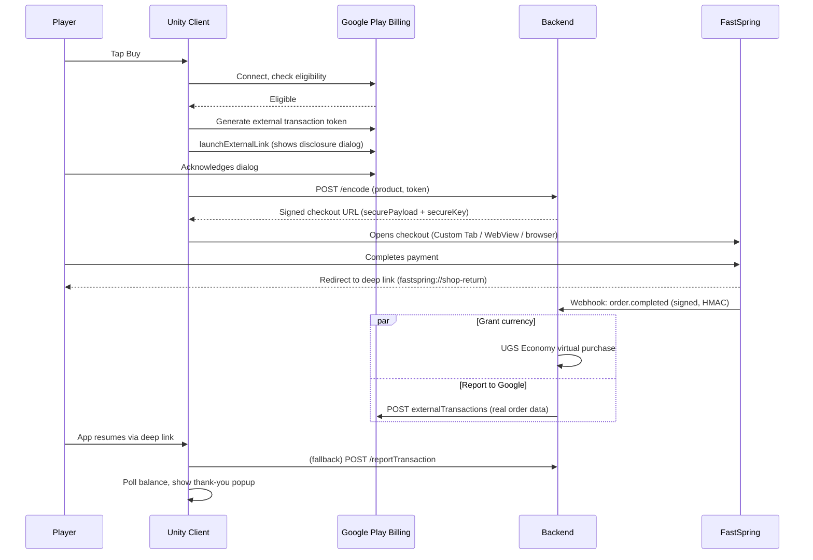

# FSBuilds: Google Play External Content Links Reporting with FastSpring

This repo shows how to report FastSpring transactions back to Google Play's **External Content Links** program (the Android "steering" program — Steer Safe on the FastSpring side), so an Android steering integration stays compliant. It's an **extension of an existing [Steer Safe](https://developer.fastspring.com/docs/fastspring-checkout-integration-with-steer-safe) integration**, not a tutorial for building one from scratch — see [What needs to already be in place](#what-needs-to-already-be-in-place) below.

The reference vehicle is **EggBlast Arena**, a Unity/UGS game. A smaller React Native example (`Native/`) also lives in this repo, showing the same base FastSpring checkout pattern for a subscription app — it does not implement Google steering and isn't covered further here.

This project lives inside FastSpring's [fastspring-fsBuilds-examples](https://github.com/FastSpring/fastspring-fsBuilds-examples) repo, alongside other FSBuilds projects.

> **Note:** This is a reference example, not an actively maintained SDK. It reflects the FastSpring, Google Play, and Unity APIs as of its last update and may not account for later changes to any of the three. Check the linked documentation in [Related resources](#related-resources) for current behavior. See [Status and known issues](#status-and-known-issues) before assuming any single piece is production-ready as-is.

**Scope note:** this is only about linking out to a **web store** for digital items, and only about **reporting** those transactions to Google — it's a US program specifically. Two things deliberately out of scope, on purpose:
- **External Content Links also covers linking to external *app downloads*** — a different flow with its own enrollment and reporting steps (`LINK_TO_APP_DOWNLOAD`, $0 reports for the download itself). Not covered here.
- **Google's separate External Offers program is for the EEA**, not the US, implemented differently with its own APIs. Don't assume the two are interchangeable.
- **Apple has an analogous External Purchase Link program** for the EU/Japan, with its own token/reporting model — see the separate `feature/apple-external-purchase-link` branch of the dev repo this was built from. Not covered here.

---

## What needs to already be in place

This repo assumes, not builds, the following — full implementation of these is covered in FastSpring's [Steer Safe integration docs](https://developer.fastspring.com/docs/fastspring-checkout-integration-with-steer-safe):

- **A FastSpring store using Steer Safe**, with an embedded checkout and at least one product configured.
- **Monetization wired through Unity** (or your engine of choice) via that Steer Safe integration — generating and opening a signed FastSpring checkout, granting the entitlement/currency on `order.completed`, and a multi-platform native web-store implementation (Chrome Custom Tab / WebView / Safari view controller depending on platform) are all assumed already working, not documented here.
- **A published Android app already using Google Play Billing Library 8.2.1 or higher.**

Because the app is already published on Play Billing, the Google Play Developer API side is largely already set up too — the one thing that may still need attention is **permissions** on the existing service account (see [Enrollment](#enrollment--setup), step 4).

> **Warning:** External Content Links is a *US-eligibility, per-user, per-enrollment* program. `IsBillingProgramAvailableAsync` returning `BillingUnavailable` for a given user is an expected, common outcome, not a bug — plan for that path, don't just test the happy path.

---

## How it works

This becomes part of the existing Steer Safe process — nothing about the base flow changes, two things are added to it:

```
Initiate purchase
  → check eligibility
  → generate a single-use token
  → show Google's disclosure
  → tag the token onto the FastSpring order
  → checkout                                    ← unchanged Steer Safe flow
  → webhook grants currency AND reports to Google in parallel
  → client confirms on return
```



**Currency granting and Google reporting are two independent obligations, not one.** Coins arrive purely through the FastSpring webhook — that part is standard Steer Safe and isn't detailed further here. Google reporting is a compliance step the program requires regardless of whether the player ever notices; a failure there never blocks or reverses the purchase.

| Case | Result |
|---|---|
| Eligible | Google's disclosure dialog shown, single-use token generated, checkout opened with the token tagged onto the order, sale reported to Google after purchase. |
| Not eligible (`BillingUnavailable`, not enrolled, wrong region) | No token, no dialog. Checkout opens normally via the existing Steer Safe flow. Currency is still granted. No Google report is attempted or owed. |

"Not eligible" is the common case, not an edge case — it usually just means the user isn't in an eligible country.

---

## Enrollment & setup

Verified as of 9/17/2026.

1. **Confirm eligibility** — see [Google's requirements](https://support.google.com/googleplay/android-developer/answer/16470497).
2. **Complete Google's [external content links declaration form](https://support.google.com/googleplay/android-developer/contact/external_content_links).** Allow up to **7 days** for an initial response, and expect possible back-and-forth before it's fully approved.
3. **Enroll the app in Play Console:** Settings → **External content links**.
4. **Grant the Play Developer API the right permissions.** Since the app is already published with Play Billing, a service account with API access likely already exists — it may just need updating. In Play Console → **Users and permissions**, grant that service account:
   - **View financial data, orders, and cancellation survey responses**
   - **Manage orders and subscriptions**

   Without both, calls to the `externaltransactions` endpoint below will fail even though the API access itself already works for everything else.

---

## Client implementation (Unity)

Scoped to games built in Unity, via Unity IAP's `ExternalBillingProgramClient` (`UnityEngine.Purchasing.GoogleBilling.Models`) — not raw Android/Kotlin. This is additive to an existing Play Billing integration; the surrounding checkout mechanics (secure payload, deep link return, balance polling) are the same Steer Safe machinery you already have. Four changes, in the order you'd make them — this repo's own [`GoogleBillingManager.cs`](Unity-UGS/Unity/Assets/Scripts/Managers/GoogleBillingManager.cs) ([documentation](Unity-UGS/Unity/Assets/Scripts/Managers/GoogleBillingManager-documentation.md)) is the tested reference implementation.

**1. Create the client once and connect it once — reuse both for the app's lifetime.**

```csharp
using UnityEngine.Purchasing.GoogleBilling.Models;
using UnityEngine.Purchasing.Models;

private ExternalBillingProgramClient _billingClient;
private bool _isConnected;

void Awake()
{
    _billingClient = new ExternalBillingProgramClient();
}

void OnDestroy()
{
    _billingClient?.EndConnection();
}

private async Task<bool> EnsureConnectedAsync()
{
    if (_isConnected) return true;

    var tcs = new TaskCompletionSource<bool>();
    _billingClient.StartConnection(
        onConnected: () => { _isConnected = true; tcs.TrySetResult(true); },
        onDisconnected: (_) => { _isConnected = false; tcs.TrySetResult(false); }
    );
    return await tcs.Task;
}
```

`StartConnection`/`EndConnection` are meant to be paired once per client lifetime — calling `StartConnection` again while a connection is already open is unsupported and can leak service bindings. Call `EnsureConnectedAsync()` at the start of a purchase attempt; it's a no-op after the first successful connect.

**2. When the player taps "Buy," check eligibility first — every time, not once at launch.**

```csharp
var connected = await EnsureConnectedAsync();
if (!connected) return; // fall back to your normal Play Billing purchase flow

var availability = await _billingClient.IsBillingProgramAvailableAsync();
if (availability != GoogleBillingResponseCode.Ok)
{
    // Not eligible, or a transient failure — see the response code table
    // below. Either way, fall back to your normal Play Billing purchase
    // flow for this purchase.
    return;
}
```

Eligibility isn't something to check once when the client connects and cache for the session — a player's country/enrollment status can change between app launch and a purchase later that session. Call this at the start of every purchase attempt, immediately before step 3.

**3. Once eligible, generate a fresh token — every single time.**

```csharp
var reportingDetails = await _billingClient.CreateBillingProgramReportingDetailsAsync();
if (reportingDetails.responseCode != GoogleBillingResponseCode.Ok) return;

var externalTransactionToken = reportingDetails.externalTransactionToken;
// Send this to your backend now, tagged onto the order about to be
// created (see Backend integration below) — don't hold onto it for a
// later purchase.
```

**4. Show Google's disclosure, then open the checkout URL yourself.**

```csharp
var launchResponse = await _billingClient.LaunchExternalLink(
    checkoutUrl,
    LinkType.LINK_TO_DIGITAL_CONTENT_OFFER,
    LaunchMode.CALLER_WILL_LAUNCH_LINK
);

if (launchResponse != GoogleBillingResponseCode.Ok) return;

// Google's disclosure was shown and accepted — now open checkoutUrl
// yourself through your existing Steer Safe checkout provider.
```

`CALLER_WILL_LAUNCH_LINK` means Play shows the disclosure and hands control straight back — your app opens the URL, not Google. That's the right mode for a web store; Google launching the link itself is the app-download case, out of scope here.

**Handle every response code this flow can return:**

| Code | Meaning |
|---|---|
| `GoogleBillingResponseCode.BillingUnavailable` | Not eligible (wrong country) or not enrolled — check enrollment status in Play Console before assuming it's a bug. |
| `GoogleBillingResponseCode.FeatureNotSupported` | Not supported on this device. |
| `GoogleBillingResponseCode.UserCanceled` | Player backed out — don't retry automatically. |
| `GoogleBillingResponseCode.DeveloperError` | Something's wrong with the request — check the debug message. |
| `GoogleBillingResponseCode.NetworkError` / `ServiceDisconnected` / `ServiceUnavailable` | Transient — retry with normal backoff. |
| `GoogleBillingResponseCode.FatalError` | Unity IAP's name for Google's generic internal error code (raw Android calls this `ERROR`) — don't proceed, retry the whole flow on the next attempt. |

**Test with license tester accounts** — Google won't invoice transactions those accounts initiate.

**On the return trip:** the reporting-relevant deep-link handling is threading the token back — the token is tagged onto the FastSpring order at `/encode` time (so the webhook can report immediately) *and* appended to the checkout URL, so the client can ask the backend to confirm/retry reporting (`/reportTransaction`) if the webhook hasn't landed yet. That's the only Google-specific addition to your existing return-deep-link handling; everything else about the return trip (re-authenticating, showing a thank-you popup, polling the balance) is standard Steer Safe and isn't detailed further here.

Source: [Play Billing — external content links integration guide](https://developer.android.com/google/play/billing/externalcontentlinks/integration) (raw Android/Kotlin — this repo's `GoogleBillingManager.cs` is the Unity-mapped version of the same sequence, verified against it directly)

---

## Backend integration

A durable store (Postgres or equivalent) is load-bearing here, not a Google requirement — it holds real order data between the webhook firing and the report going out, since a request can arrive before its webhook does or vice versa. Four steps, in order:

**1. Tag the token onto the FastSpring order at checkout.**

Wherever your existing `/encode` payload is built, add the token from client step 3 as an order tag:

```ts
// Existing /encode handler — add googleExternalTransactionToken to tags
const payload = {
  items: [{ product: productId }],
  tags: {
    playerId,
    googleExternalTransactionToken: externalTransactionToken // from the client
  }
};
```

FastSpring echoes tags back on the `order.completed` webhook — this is the only thing that connects "player tapped Buy" to "FastSpring says the order completed" later.

**2. In your `order.completed` webhook handler, build and send the report.**

Add this alongside wherever the webhook already grants the entitlement, not in place of it. The two run independently — a reporting failure must never block or delay the actual purchase grant.

```ts
async function reportToGoogle(externalTransactionToken: string, order: FastSpringOrderCompletedEvent) {
  const accessToken = await getGoogleAccessToken(); // step 3, below
  const externalTransactionId = order.id; // FastSpring's own order id — see gotchas below

  const response = await fetch(
    `https://androidpublisher.googleapis.com/androidpublisher/v3/applications/${PACKAGE_NAME}/externalTransactions` +
    `?externalTransactionId=${encodeURIComponent(externalTransactionId)}`,
    {
      method: 'POST',
      headers: {
        Authorization: `Bearer ${accessToken}`,
        'Content-Type': 'application/json'
      },
      body: JSON.stringify({
        // priceMicros is millionths of the currency unit — $4.99 -> "4990000"
        originalPreTaxAmount: { priceMicros: toPriceMicros(order.subtotal), currency: order.currency },
        originalTaxAmount: { priceMicros: toPriceMicros(order.tax), currency: order.currency },
        transactionTime: new Date(order.changed).toISOString(),
        oneTimeTransaction: { externalTransactionToken },
        userTaxAddress: { regionCode: 'US' }, // this program is US-only — nothing to derive per-order
        externalContentLinkDetails: { linkType: 'LINK_TO_DIGITAL_CONTENT_OFFER' } // this program specifically, not externalOfferDetails
      })
    }
  );

  if (!response.ok) {
    // Log it and leave unreported — a webhook redelivery or a scheduled
    // sweep gets another shot at it. Don't throw and fail the whole
    // webhook handler over a Google-side rejection.
    console.error('[reportToGoogle] rejected:', response.status, await response.text());
    return;
  }

  await markReported(externalTransactionToken); // step 4, below
}

function toPriceMicros(amount: number): string {
  return String(Math.round(amount * 1_000_000));
}
```

**3. Get an access token for the service account permissioned in Enrollment step 4.**

```ts
import { google } from 'googleapis';

// Module-level, not constructed per call — google-auth-library caches and
// refreshes the resolved access token internally once this has been used.
const auth = new google.auth.GoogleAuth({
  credentials: JSON.parse(process.env.GOOGLE_SERVICE_ACCOUNT_JSON),
  scopes: ['https://www.googleapis.com/auth/androidpublisher']
});

async function getGoogleAccessToken(): Promise<string> {
  const client = await auth.getClient();
  const { token } = await client.getAccessToken();
  if (!token) {
    throw new Error('Failed to obtain Google access token');
  }
  return token;
}
```

**4. Track what's already been reported, and check it before step 2 runs.**

```ts
// { token TEXT PRIMARY KEY, reported_at TIMESTAMPTZ }
async function alreadyReported(token: string): Promise<boolean> {
  const row = await db.get('SELECT reported_at FROM google_reports WHERE token = $1', [token]);
  return !!row?.reported_at;
}

async function markReported(token: string) {
  await db.query('UPDATE google_reports SET reported_at = now() WHERE token = $1', [token]);
}

// Wherever the webhook currently grants the entitlement, add:
if (!(await alreadyReported(externalTransactionToken))) {
  await reportToGoogle(externalTransactionToken, order);
}
```

This table is what makes redelivery safe — check it first, and skip straight past an order that's already been reported instead of calling Google again.

**Gotchas that don't fit neatly into a step above:**
- **Use FastSpring's own order id as `externalTransactionId`**, not a freshly generated one per attempt — Google treats it as the idempotency key for this call specifically, on top of the `alreadyReported` check in step 4. Two layers of idempotency, not redundant: step 4 stops a second call from happening at all; a stable `externalTransactionId` stops Google-side duplication even if a second call somehow does happen.
- **Renewals/recurring charges don't carry a token at all** — send a fresh `externalTransactionId` per charge plus `initialExternalTransactionId` referencing the very first transaction in the series. Not applicable to a one-time digital-item purchase; this repo only ever sends `oneTimeTransaction`.
- **Google rejects the call outright** for a user/region not eligible under the program — this isn't only a client-side gate, the backend enforces it too, so a report can fail even after the client-side eligibility check passed if something changed in between.
- **Rate limits are per Google's standard API quotas** (the `ExternalTransactions` group is its own quota bucket) — not a concern at this integration's scale; check the [Google Play Developer API quotas page](https://developers.google.com/android-publisher/quotas) for current numbers if this ever needs to report in bulk.
- **Refunds** go through a separate endpoint, `externaltransactions.refundexternaltransaction`, referenced by the original `externalTransactionId` — not covered above since this doc is scoped to reporting a completed purchase, not handling refunds.

Source: [Play Billing — integrating your backend outside GPB](https://developer.android.com/google/play/billing/outside-gpb-backend)

---

## Repository layout

```
.
├── Unity-UGS/                  The reference build: Unity game + Node backend + web checkout page
│   ├── Unity/                  Unity 6000.0.59f2 project (EggBlast Arena)
│   ├── Backend/                Express/TypeScript server deployed to Railway (also serves WebCode/)
│   └── ...
├── Native/                     React Native (Expo) subscription example — no Google steering, not detailed here
├── docs/                       Related design docs (untracked)
├── .github/workflows/          Manual "Generate Build" workflow for Unity and RN targets
└── My project (1)/             Stray empty Unity template project, untracked (safe to delete)
```

Per-folder READMEs go deeper on setup: [Unity-UGS](Unity-UGS/README.md) · [Unity client](Unity-UGS/Unity/README.md) · [Backend](Unity-UGS/Backend/README.md) · [WebCode](Unity-UGS/Backend/WebCode/README.md) · [React Native app](Native/App/FSReactApp/README.md).

The backend also exposes a handful of gameplay-economy routes (`/spend`, `/earn`, `/earnEggs`, `/checkLevelUp`) and a separate native-purchase-validation route (`/validateGooglePurchase`) that aren't part of the Google reporting flow described above — see the per-folder READMEs if you need those.

---

## Environment variables

Set these in Railway, or a local `.env` (the Google-reporting-relevant ones):

| Variable | Purpose |
|---|---|
| `GOOGLE_SERVICE_ACCOUNT_JSON` | Full JSON of a Google Cloud service account with Play Developer API access, permissioned per [Enrollment](#enrollment--setup) step 4 |
| `DATABASE_URL` | Postgres connection string — stores real FastSpring order data for Google reporting, plus replay-protection state (see [Security](#security)) |
| `FASTSPRING_WEBHOOK_SECRET` | The HMAC SHA256 secret set on the FastSpring webhook. `/webhook` verifies `X-FS-Signature` against this and **fails closed** — every delivery is rejected with 500 until this is set to match |

The base Steer Safe integration needs its own set (UGS project/service account, FastSpring RSA private key, etc.) — see [Unity-UGS/Backend](Unity-UGS/Backend/README.md) for the full list.

```bash
cd Unity-UGS/Backend && npm install && npm run build && npm start
```

---

## Building

`Editor/BuildScript.cs` sets the scripting define for a variant and builds; the define chooses which store-opening provider is used. Building via the Unity Editor's normal Build Settings window instead (rather than one of `BuildScript.cs`'s `-executeMethod` entry points) sets none of these defines, so the Google steering path is silently skipped, not broken — always build through `BuildScript.cs` (or the CI workflow) if you want to test steering. See [Unity-UGS/Unity](Unity-UGS/Unity/README.md) for the full target list.

---

## Testing

Use FastSpring's sandbox test card for purchases (**`4242 4242 4242 4242`**, any future expiry; the CVV is unique to your account, found in the FastSpring dashboard).

Three scenarios worth walking through:
- **The eligible path** (Android, US-eligible test account) — confirms the disclosure dialog, token generation, and the post-purchase Google report all fire.
- **The ineligible path** (not enrolled, wrong region, or iOS) — confirms the purchase still completes and grants currency with no Google reporting attempted.
- **Webhook redelivery** — confirms no double-grant, no double-report.

In the Unity Editor, press **D** while `GameplayScene`/`MainScene` is running to simulate the return deep link without a real device or checkout.

Backend: `npx tsc --noEmit` from `Unity-UGS/Backend` type-checks the whole server with no build step. There's no automated test suite for either the backend or the Unity client — verification so far has been manual, against a live sandbox order.

---

## Security

Points specific to the Google reporting layer:

- **Generate the Google token fresh every time, never cache** — Google's own guidance, and this repo follows it (see client step 3 above).
- **Keep the Google service account key server-side only** — `GOOGLE_SERVICE_ACCOUNT_JSON` is only ever read by the backend, never shipped in client code.
- **Don't let reporting block or delay the actual purchase grant** — the webhook runs currency-granting and Google reporting independently (see [How it works](#how-it-works)).
- **Webhook signature verification.** `/webhook` verifies FastSpring's `X-FS-Signature` (HMAC-SHA256, constant-time comparison) against `FASTSPRING_WEBHOOK_SECRET` and fails closed if unconfigured — without this, anyone who could reach the endpoint could forge an `order.completed` body and mint currency for free. See FastSpring's [webhook security guidance](https://developer.fastspring.com/reference/webhooks-overview).
- **Replay protection.** A redelivered webhook won't re-grant currency or re-report an already-reported order to Google — both keyed by FastSpring's own identifiers, using a claim/grant/fail state machine so a genuinely failed attempt can still be retried.

**The private key, Android keystore, and upload key were committed in an earlier revision of this repo and remain in git history.** Treat them as compromised regardless of what's tracked today: generate a fresh FastSpring key pair and upload the new public cert, and request an upload-key reset in Play Console before using this as a starting point for anything real. History was deliberately left intact rather than rewritten.

---

## Status and known issues

### RESOLVED (2026-09-18): Google's `externaltransactions` API previously rejected the required field

Between 2026-08-28 and 2026-09-18, calls to report a transaction could fail with:

```
HTTP 400 INVALID_ARGUMENT
Field external_transaction.external_content_link_details must be set for external content link transactions
```

...even when `externalContentLinkDetails` is populated in the request. What's been established:

- Google's *public* REST schema documents only `externalOfferDetails`, a different program (External Offers, not External Content Links). Sending that field is rejected outright for this app ("must only be set for external offer transactions").
- `externalContentLinkDetails` isn't in the public schema, but Google's parser does accept the field name (an unknown field produces a distinct "Cannot find field" error, which this doesn't) — its value just doesn't seem to reach validation, whether populated, empty, or omitted.
- Region and payload ordering have been ruled out as causes.

At the time, the read was a server-side gating/allowlist gap on Google's side for this app's access to Content Links reporting, not a client payload bug.

**Confirmed resolved 2026-09-18.** Google's public REST reference for `externaltransactions` now fully documents `ExternalContentLinkDetails`, with `linkType` marked **Required** — matching exactly what this repo sends — and a live test call against the real endpoint (`scripts/test-google-report.ts`, same request shape as `app/utils/google.ts`'s `reportTransactionToGoogle`) returned `200 OK` with `transactionState: TRANSACTION_REPORTED` and `externalContentLinkDetails` echoed back unchanged. No code changes were needed — this was purely a Google-side gap that has since closed. If you still hit the 400 above, it may be an account-specific enrollment/allowlist issue worth a support ticket, not something wrong with this repo's request shape.

### Other open items

- No automated tests, on either the backend or the Unity client.
- `My project (1)/` at the repo root is an unrelated, empty Unity template with its own `.git`. It's untracked and safe to delete.

---

## Related resources

- [Unity/UGS and FastSpring checkout integration with Steer Safe™](https://developer.fastspring.com/docs/fastspring-checkout-integration-with-steer-safe) — **start here** for the base integration this repo extends
- [FastSpring Webhooks Overview](https://developer.fastspring.com/reference/webhooks-overview)
- [FastSpring Secure Payloads](https://developer.fastspring.com/reference/pass-a-secure-request)
- [Google Play External Content Links — program overview](https://developer.android.com/google/play/billing/externalcontentlinks)
- [Google Play External Content Links — integration guidance](https://developer.android.com/google/play/billing/externalcontentlinks/integration)
- [Google Play External Content Links — enrollment](https://support.google.com/googleplay/android-developer/answer/16470497)
- `docs/` in this repo (untracked) — related design notes for the analogous Apple External Purchase Link work, on a separate branch
